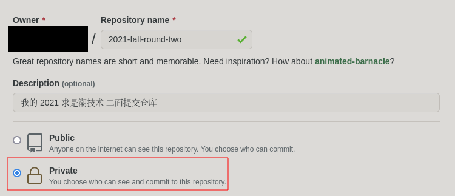
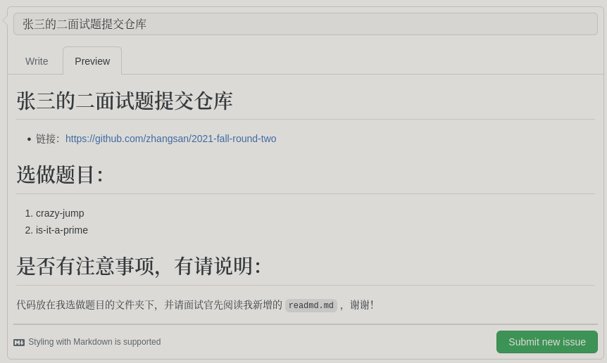
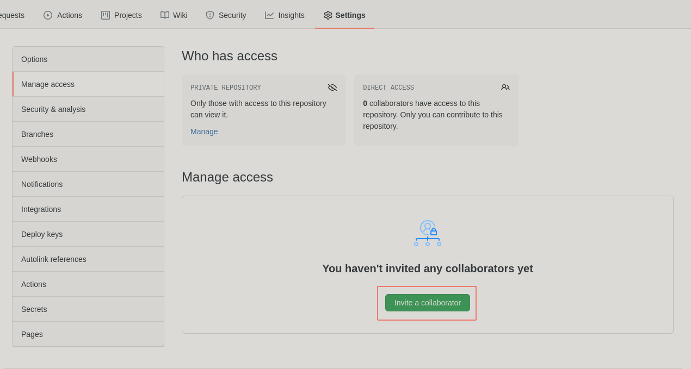
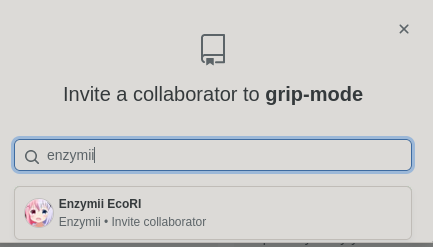

> Contributor：@异特龙
# 二面试题提交
> 如果您打算使用 gitee 提交，请看另一份文档：`README_gitee.md` 。
> 如果您没有某些众所周知的工具的话，对 `github` 的访问可能会不稳定。此时您需要使用 gitee 代替。

## 面试官名单
#### crazy-jump
* @Enzymii
#### is-it-a-prime
* @RalXYZ
* @Enzymii
#### qr-code-playground
* @Deluxurous
#### to-frontend-newbie
* @palemoons
#### 仓库维护者
* @dinoallo

## Tl;dr
1. 复制 / 镜像一份二面试题到自己 Github 的*私有*仓库
2. 提交代码
3. 将选做题目的**出题面试官**和**仓库维护者**（名单参见上方“面试官名单”），设为协作者
4. 到*原仓库*发一个 issue （模板参见置顶 issue ）

如果你已经很清楚以上几个步骤该如何操作，那么可以跳过 Step-by-Step Guide 。如果你有至少一个步骤不熟悉，那么请你仔细阅读引导。

## 注意事项

### 面试期间请积极查看 Github 通知

如果你的提交格式有误，或者面试官没有权限查看仓库，面试官会在你的 issue 下提示，若已提醒而错误未修正，面试者将自行承担后果。

### 请不要向仓库上传任何文件压缩包（包含 zip, rar 等）

如成品以压缩包方式打包，面试官有权不受理，请面试者自行承担后果。如有特殊需求，请咨询面试官。

### 请不要向仓库上传音频及视频

gif 文件在容许范围内。

### 请不要在仓库中透露任何私密信息（如私钥及密码）

如果你的工作目录下包含任何私密信息文件，请参考 `gitignore` [相关教学文章](https://linuxize.com/post/gitignore-ignoring-files-in-git/) 来回避上传这些文件。

# Step-by-Step Guide
## `git`
`git` 是一个版本控制系统，在本次面试过程中，我们使用 `git` 来提交成品。
关于 `git` 的具体用法，请搜索相关文章，或参考这本书：[Pro Git 中文版](https://git-scm.com/book/zh/v2) 。
## 提交方式
在掌握了基本的 `git` 操作之后，就可以提交你的代码了！
> 请注意，在进行每一步的同时，请思考每一步命令甚至每一个参数的作用。
### 在 Github 上配置 ssh key
> [什么是 ssh ？](https://docs.github.com/cn/github/authenticating-to-github/connecting-to-github-with-ssh/about-ssh)
#### 生成 ssh 密钥
如果你已有 ssh 密钥，可以跳过这个步骤。如果你没有，请参考：[生成 ssh 密钥](https://docs.github.com/en/github/authenticating-to-github/connecting-to-github-with-ssh/generating-a-new-ssh-key-and-adding-it-to-the-ssh-agent) 。
#### 添加密钥到 Github
关于如何配置 Github ssh key ，参考：[添加 ssh 密钥到 Github 账户](https://docs.github.com/en/github/authenticating-to-github/connecting-to-github-with-ssh/adding-a-new-ssh-key-to-your-github-account) 。
### 新建 Private Repository
在 Github 上，新建一个 **Private** Repository ，并*命名为 `2021-fall-round-two`* 。

### `git clone` 原本的 Repository
命令如下：

``` shell
git clone --bare git@github.com:QSCTech/2021-fall-round-two.git
```
### `git push` 一份题目到自己的 Private Repository
进入 `2021-fall-round-two` 文件夹，执行如下命令：

``` shell
git push --mirror git@github.com:<your_username>/2021-fall-round-two.git # 把 <your_username> 替换为你自己的 Github 用户名
```

### `git clone` 自己的 Private Repository
提交题目的仓库是自己的 Private Repository ，之前克隆的原 Repository 就没用了，可以删除，并请不要提交到原 Repository 。

``` shell
git clone git@github.com:<your_username>/2021-fall-round-two.git # 克隆自己的私有仓库
```

### Go hacking!
克隆完自己的仓库后，就可以开始在仓库文件夹下写程序了！

### `git push` 同步当前 commits 至 Github
当你想同步目前的工作进度，或者想提交代码时，运行以下命令：

``` shell
git push -u origin
```

### 提交 issue 到原仓库
如果你已经准备好让面试官 review 自己的成品了，请到原题目仓库新增一个 issue，格式请参考：


### 给予面试官协作者权限
根据你选的题目，务必让*出题的面试官* 和*仓库维护者*成为协作者：




面试官能正确查看你的仓库（见下方注意事项）后，会在 issue 下回复，提交就算完成了。

## 更新二面试题仓库
有时你会接到面试官让你更新仓库的通知，或者你已经很久都没有操作仓库了，你手边的仓库可能已经不是最新的了，为了避免你与面试官和其他面试者的信息不对等，我们必须得到最新版本的仓库。
> 强烈建议大家要时常更新仓库，频率大概是半天到一天，如果面试官通知你，**一定要更新** 。

### 将原仓库设为你私有仓库的 remote

``` shell
git remote add upstream git@github.com:QSCTech/2021-fall-round-two.git # upstream 为原仓库
```
这个步骤只需要做一遍即可，建议大家在仓库刚克隆下来时，执行这行命令，之后更新仓库便不需要重新执行一次了。

### 从原仓库获取更新并合并

``` shell
git pull upstream
```
如果你的 git 的暂存区没有任何东西，那么只需执行以上步骤就可以完成更新。


#### 如果你已经用 `git add` 命令暂存了一些代码
我们可以利用 `git stash` 命令：
``` shell
git stash
```
然后按照上面所说的获取更新，再执行：

``` shell
git stash pop
```
之前的改动就会回来了。
