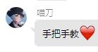
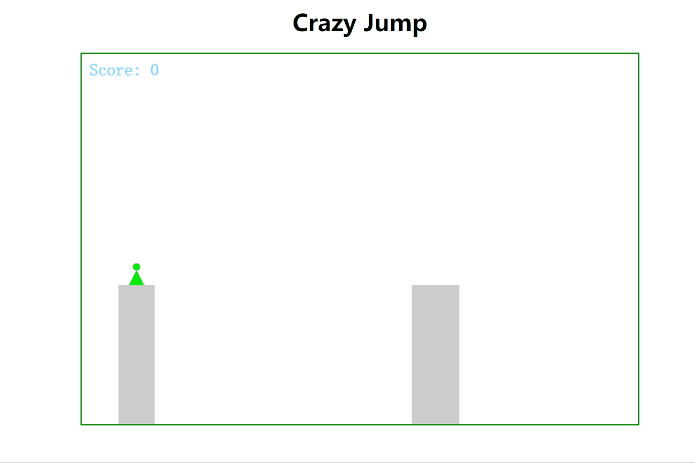

# 写给幼儿园小朋友的 H5 小游戏入门

## 阅前须知

- 本文主要面向完全没有基础的人, 如果对 canvas 有一定程度的了解的话, 强烈建议去看看隔壁的几道题目, 继续下去可能会浪费生命中的几个小时
- 以下会出现一些 Task 和简单的 Question, 所有的 Task 可以在你的代码中体现, 而对于 Question 来说, 希望你可以在目录下另附一个文档来写下你的答案(什么格式的文件都行, 不过希望尽可能不要使用[二进制文件](https://en.wikipedia.org/wiki/Binary_file))
- **除了文末的 Question 以外**, 所有的 Task 和 Question 都不会强制要求你完成, 你只需要尽自己最大的努力独立来做就好, 我们会乐于在二面的过程中和你交流你的经历和困难哦~ 以及, Question 的答案虽然基本都可以从搜索引擎中查到, 但是希望不要原封不动的复制粘贴, 而是融入自己的理解和思考
- 文章中给出的链接大概都是英文版, 因为就如同小说一样, 再高深的译者也不能保证 100%保留原文的风味, 还希望大家尽可能去阅读英文文档, 培养见到英文文档不发怵的胆魄
  阅读这些文档并不需要太高的英语水平, 大家都能考上浙江大学的话肯定都冰雪聪明没啥问题, 遇到个别不认识的单词就找个翻译软件翻译一下就好 ww
  ~~当然事实上, 确实有不少链接是有对应的中文版的, 实在想看的话可以自寻方式 XD~~
- 单纯完成任务不是目的, 在过程中有所成长才是最大的收获. 请记住: **我们看重的不仅仅是你的能力, 更重要的是你的态度**
- _出题人并不是 Switch_~~_, 有事也请不要去惊扰 Switch_~~
- Have fun~ :-D

## 故事背景

三岁半的 Baby Switch 超喜欢玩各种小游戏

她最近突然想写游戏了, 我们和她一起做吧



~~一看就是懒得编了~~

## 目标演示



这只是一个方便大家理解我们要干什么的图, 相信大家肯定能创作出比这个美观, 比这个好玩的版本 ww

## 让我们开始吧

### 提前准备

> 工欲善其事，必先利其器。———《论语·卫灵公》

为了获得更好的开发体验, 人们发明了各种有利于开发的工具, 你最好挑选一个用着趁手的工具, 这会大大的改善你的开发体验

如果你还不太清楚自己需要什么, 可以看看 Baby Switch 在用什么; 如果你不知道它们是什么, 你最好去求助于搜索引擎了解一下

- [git](https://git-scm.com/)
- [vscode](https://code.visualstudio.com/) (并请自行选择安装你喜爱的插件, 如果没有头绪或许可以提问

~~当然像这次这么简单的任务 完全可以使用记事本解决啦~~

### Let's Code!

#### 搭架子

首先, Baby Switch 打算让她的游戏在浏览器里运行. Baby Switch 在搜索引擎上查了一下, 认为自己应该使用 html + css + js 来完成任务, 所以她创建了一个文件夹, 然后新建了几个文件

```plain
.
├── lmth.html
├── sj.js
└── ssc.css
```

(我劝你**最好不要**像她这样起文件名..)

> #### Task
>
> 请参照[MDN](https://developer.mozilla.org/en-US/docs/Learn/Getting_started_with_the_web/HTML_basics)搭建一个 html 文件的框架, 其中应该至少包含:
>
> - 对网页标题的修改 (`<title>`)
> - 对`.js`和`.css`文件的引入
> - 一个大标题(`<h1>`或别的什么标签)
> - 一个`<canvas>`, 并且请给它一个`id`, 这在之后应该会有大用

然后, 她就可以在浏览器中打开这个 html 文件啦, 她看到自己写的东西被展示出来, 非常开心

不过她觉得, 这个布局不太好看...

> #### Task
>
> 通过编写 css 文件, 对标题和 canvas 实现水平居中 (其实只需要一点点 css, 如果能使用 flex box 来完成就更好了 w)
>
> - [不懂 css 的话可以戳这里](https://developer.mozilla.org/en-US/docs/Learn/CSS)
> - [或许能用到的 flex box 指北](https://css-tricks.com/snippets/css/a-guide-to-flexbox/)

> #### Question
>
> 通过常识/查阅相关资料可以知道, canvas 标签是有`width`和`height`属性的, 而 css 中, 我们也可以给 canvas 设置`width`和`height`, 那么它们有什么不同呢? 如果把它们设置了不一样的值又会发生甚么呢? 请谈谈你的理解

#### 画画

由于网页里元素就那么些, 那么我们想画一个游戏出来肯定就是要对那个 canvas 下手了.

根据 Baby Switch 浅薄的理解, 对 canvas 的控制应该是 js 的活, 因此她打开了 js 文件, 准备往里面填代码.

不过 Baby Switch 并不会 JavaScript, 所以她决定去找[一个 JS 教程网站](https://javascript.info/)学习一下

她发现, 自己似乎只需要学会[JavaScript Fundamentals 这一章节](https://javascript.info/first-steps)的内容就可以了, 而其中似乎有相当一部分和自己半年前接触到的 C 语言差不多的样子(也就是说大概 4.8.9.10.11.13.14.15 这几个部分草草过一遍就行啦), 所以她用了几个小时就学的差不多了, 相信冰雪聪明的你也一定没有问题哒~

由于 Baby Switch 是纸片人, 所以她认为她不需要一个 3D 的游戏, 因此她只打算整一个 2D 版本的

那么要做什么呢? 她决定从先学习学习怎么画, 从画一个小人开始

> #### Task
>
> 实现一个**在指定位置**绘制小人的函数, 你可以给它起名叫`drawHero`或者别的什么你喜欢的名字 (不过如果你能遵守[小驼峰命名规则](https://wiki.c2.com/?LowerCamelCase), 那会让 Baby Switch 很开心
>
> 这个小人最好有一个圆圆的脑袋, 身体的样子倒不是很重要, 或许你可以画一个三角形, 或者矩形? emm...五角星可能会有些奇怪, 但好像也不是不行
>
> 众所周知, 鲜艳大胆的用色会极大的吸引幼儿的注意, 所以, Baby Switch 会给她的小人涂一个鲜艳的颜色, 希望你也这样做
>
> 在这一步中, 如果你感到毫无头绪, 你可以看看[这里](https://developer.mozilla.org/en-US/docs/Web/API/CanvasRenderingContext2D), 它甚至会带你手把手画一个可爱的小房子 w

> #### Question
>
> _如果你有一个具有良好代码提示的工作环境, 那么可能会更好的帮助你回答和体会这个问题_
>
> 假如说, 你的 canvas 的 id 属性被赋值为了"my-canvas", 那么
>
> `const myCanvas = document.getElementById('my-canvas')`
>
> 这里的`myCanvas`这个变量的类型是什么?
>
> `getContext`是什么类型的方法?
>
> 为什么我们可以调用`myCanvas.getContext()`?

在你学会画小人之后, 那么场景里面有的元素你应该都会画了吧~

比如小人起跳的平台, 比如力度条, 比如显示分数或者别的什么的.. 这里就请你自由发挥啦~

#### 画动画

那么显然, 我们现在可以渲染出静态的画面了, 但是如果作为一款游戏, 那么我们肯定是要让我们的小人动起来的

根据[wikipedia 上动画的定义](https://en.wikipedia.org/wiki/Animation), 我们很容易知道, 动画其实是一帧一帧的静画连续播放营造出的效果

就像现在 Baby Switch 喜欢看的各种动画片, 每秒会播放 24 帧, 也就是每秒会渲染 24 张图片(默认 1k 作画前提下)

那么我们想要播放动画, 自然也需要进行一个按帧的播放

Baby Switch 非常幸运的找到了这样一个函数: [requestAnimationFrame](https://developer.mozilla.org/en-US/docs/Web/API/window/requestAnimationFrame)

> #### Task
>
> 阅读文档(也可以不阅读), 调用`requestAnimationFrame`函数, 按帧渲染刚才你画的静画
>
> 想体会动感的话, 你可以在每一帧中修改一些参数的值, 让每一帧静画的渲染有一些区别 (比如修改蓄力条, 或者小人的位置什么的)

> #### Question
>
> 你知道 setInterval 函数吗? 它是做什么的? 为什么做动画的时候常用 requestAnimationFrame 而不是使用 setInterval 每隔多少 ms 触发一次呢? 谈谈你的理解

那么我们现在已经会画动画了! 那么我们来添加最重要的动画吧

> #### Task
>
> 实现一个小人起跳后的抛物线
>
> 你可能需要一点点数学/物理知识, 比如你要知道, 在斜上抛运动中, 横纵坐标与时间, 是具有函数关系的
>
> 这里的初速度啦, 重力加速度啦, 都可以由你来自由设置, 毕竟这是由你创造的世界~
>
> _(Baby Switch 并没有上过高中, 所以这里可把她为难坏了_

#### 添加控制

这个游戏已经能动了, 但是还不能玩, 我们现在来让它能玩

我们有一些所谓的[GlobalEventHandlers](https://developer.mozilla.org/en-US/docs/Web/API/GlobalEventHandlers), 通过它们我们可以添加对于事件的相应, 比如按键盘啦, 动鼠标啦以及别的一些什么

> #### Task
>
> 添加控制系统, 使得按下键盘时蓄力, 松开键盘后让小人起跳
>
> _Hint: 你可能会用到上面参考链接中的`onkeyup`或者`onkeydown`_, 当然或许你还想添加别的, feel free to do so~

#### 其他

好了, 要学的东西 Baby Switch 已经基本都会了, 相信你也基本都会啦, 现在就把刚刚学到的东西灵活运用吧~

> #### Task
>
> 生成位置和宽度随机的平台
>
> 添加小人有没有成功跳到对面平台的判断
>
> - 如果跳到了, 分数+1, 渲染下一个平台 (或许你可以把镜头往右, 或许你也可以把平台往左
> - 如果没跳到, 游戏结束, 或许你需要渲染一个游戏结束的界面
>
> 提供至少一种游戏重新开始的方式
>
> 美化游戏的界面, 或许在画布里添一些飘忽不定的云, 或许在画布外贴个背景图片, 或许... 这是发挥创造力的好时机!
>
> 添加其他你觉得应该有的东西... 这是你的世界, 你想做什么都可以~

### 分享

啊 上帝啊 我们就这样完成了一个游戏~

我要把它分享给亲朋好友们耍~

那么, 与其把这几个文件分享出去, 为什么不尝试把它在什么地方部署一下呢?

如果你还没有自己的服务器, [Github Pages](https://pages.github.com/)可以是一个选择.

> #### Task
>
> 在一个什么地方用什么方式部署你的游戏

### Summary

> #### Question
>
> 注意: **此题为必答题, 选择该题目的人请务必对该问题作出回答**
>
> 在完成整个项目的过程中, 你有什么心得和体会?
>
> 你觉得这篇文章你可以打几分? (满分 10, 保留到整数即可)
>
> 你还有什么想说的?

那么就到这里了, 期待与你的见面~

以上
