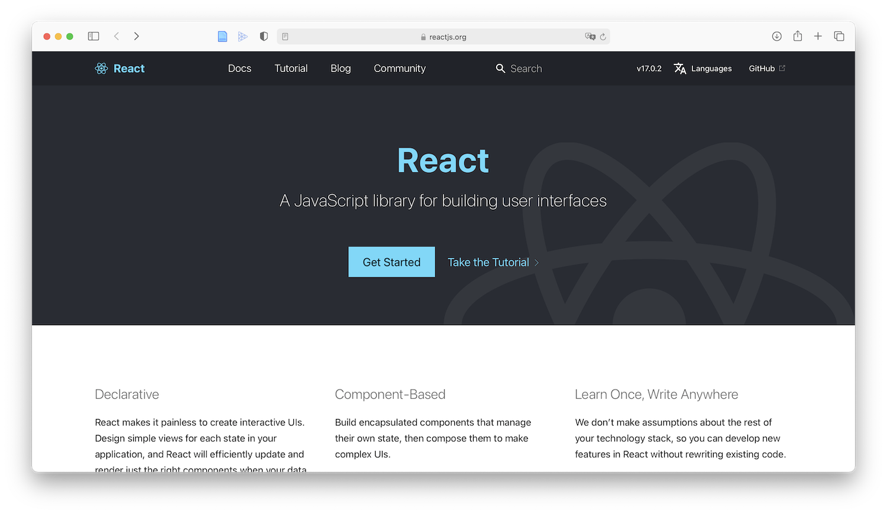
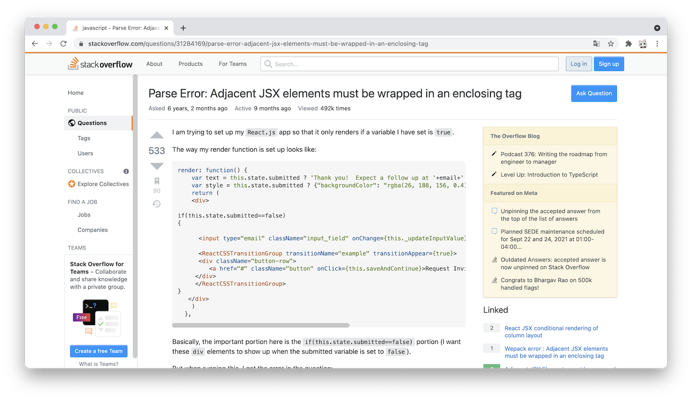

> Contributor: 喵刀🐱

# 0. 开始之前

## 一些前言

你好啊👋欢迎阅读这本《前端入门指北》。

在报名和一面的过程中，我看到许多表示对前端有强烈兴趣的同学，我很高兴有这么多志同道合的朋友，也祝大家能顺利加入求是潮，与前端小组一起参与Web开发。

这本指南主要面向没有学习过任何编程语言、不了解或了解一点点网络开发的朋友，其中我会简单向你介绍所谓的前端三件套，重点帮助你入门React框架。如果你并不是完全没有基础，可以选择性阅读。《指北》的最终目标是希望你入门现代前端，对未来的学习路径有一定的认识。在二面时，我们会让你谈谈你对这段时间学习的理解。

《指北》会解决这些问题：

1. 什么是文档？我为什么要看文档？
2. 当我遇到开发问题时（例如报错），我该如何解决？
3. 为什么我要使用命令行？我该如何装包？
4. 如何快速了解前端三件套？我应该学到什么程度？
5. React是什么东西？我该如何搭建一个前端项目？

请注意，这本《指北》是一篇指导性教程，希望能达到授人以渔的目的。文档编写者能力有限，不可能事无巨细，欢迎捉虫。

## 需要完成的Tasks

（部分）阅读正文之后，你需要完成这些任务，其中`E`表示是附加题。

- [ ] 下载Windows Terminal，并截图展示。

- [ ] E：尝试对Terminal进行美化，并将你美化后的终端界面截图。

- [ ] 安装Nodejs LTS/Current (Latest)版本，并截图展示你所安装的版本。

- [ ] E：如果使用了`nvm`管理nodejs版本，那么使用`nvm list`指令展示你的环境中安装的全部版本。

- [ ] E：把npm的源更换为淘宝源，并截图展示。

- [ ] E：安装yarn，并展示你所安装的yarn版本。

- [ ] 使用`create-react-app`创建你的React项目，并截图展示本地运行的首页。

- [ ] ⭐️现在你有一大批结构类似的数据，例如这样：

  ```json
  [
   {
    "sentence": "一个细胞里，却分裂出了两种截然不同的命运。",
    "from": "秦明「法医秦明」"
   },
    {
    "sentence": "人间忽晚，山河已秋。",
    "from": "亦沫不吃鱼「人间忽晚」"
   },
    {
      "sentence": "失去故土的花朵，回不去，却也离不开。",
      "from": "夏达「长歌行」"
    }
   ]
  ```

  现在，你需要将这里面的内容，批量显示在网页中，最后你需要**提交你的代码**。你需要使用flexbox来对每一个“小卡片”（也就是一句话以及它的出处）进行排版。你可以自己添加更多的“小卡片”，那么此时，你需要注意一条语句的最小宽度，并在合适的时候换行。

  > Hint：你可能会使用的技术
  >
  > - flexbox
  > - 数组方法
  > - DOM树操作

# 1. 文档

> 当我要学习一门新语言、一个新框架或者一个新工具时，我该怎么学？

当我从高中毕业的时候，我对这个问题也一头雾水，我在初学前端时也走了很多弯路，看过b站的视频、翻过5年前的博客...显然，视频和其他开发者的博客并**不是第一手知识**，有些教程甚至是**过时**的。因此，我强烈不推荐参与二面的同学通过看b站、查CSDN博客的方式学习接下来要介绍的前端内容。如果你非常想知道我为什么这样建议，欢迎和我讨论。

对于开发者而言，查阅官方文档是最好的选择——



文档的内容通常有快速上手(Tutorial)、文档(Docs)、API文档(API)以及可能会出现的常见问题模块(Q&A)，文档一般都能帮助你完成~~从入门到入土~~的全过程，堪称一条龙服务。

**不要因为文档是英文就跑路！**我推荐你尽量阅读英文文档，因为它们大多数时候都是最新版本。当然，如果你认为阅读起来存在一些困难，也可以尝试将语言切换为中文（目前已经有不少文档有中文翻译），但是需要注意的是，有些中文文档不一定是最新的。同时，不是所有的文档都有中文翻译。

希望你从一开始就养成翻阅文档的好习惯👍

# 2. 开发问题

> 如何使用网络资源解决大部分问题？

在过去的面试中，我们也强调过如何向二面群中的负责解答问题的同学提问。[提问的智慧(此处是中文翻译版)](https://github.com/ryanhanwu/How-To-Ask-Questions-The-Smart-Way/blob/main/README-zh_CN.md)是每一位开发者应该了解的文档。

不过在提问之前，我先简单向你分享我自己解决问题的过程，相信你能通过这个方式自己解决大部分编程问题。

1. 找到报错提示，例如这样：

   

   这是一个常见的React编译报错，第一行是出错的源文件路径，第二行则是出错原因。

2. 直接从报错描述中解决

   有一些报错会直接给出可能的解决方案。这个例子就是如此`Did you want a JSX fragment <>...</>?`。

3. Search engine!

   如果你无法用自己的能力解决问题，我推荐你通过搜索引擎查询解决方案。

   - 我**强烈不推荐百度👎**如果你有过百度搜索开发问题的经历，你一定不会对那些垃圾信息感到陌生。随着你深入学习前端开发，百度搜索结果对你的帮助会越来越少。并不是在说百度一无是处，只是希望你能有意识地使用下面两款搜索引擎。

   - 如果你没有科学上网的工具，**Bing海外版**是一个可选的搜索引擎。
   - 如果你能够访问不存在的网站，那么**Google**当然是很好的选择。

   一般来说，你只需要把报错信息贴进搜索框，就能够搜索到对应问题。

   

4. Stackoverflow！

   现在向你隆重推荐[stackoverflow](https://stackoverflow.com)，开发的大部分问题都能在这个网站上找到答案，通常，这个网站会出现在搜索引擎结果的第一条。当然，是全英文。（虽然访问速度很慢，但它的确**没有被墙掉**）

   

5. 向面试官求助

   如果你仍然无法解决问题，向负责解答问题的同学提出问题是最后的选择。但请注意，不要总是提出一些`Stupid question`

   怎样的问题才是好问题？欢迎阅读《提问的智慧》😸

# 3. 命令行

对于大部分过去没有接触过编程的同学，在使用电脑的过程中都几乎不会见到命令行界面（CLI）。但从现在开始，你要做的很多事情都不得不用命令行解决。

## Terminal！

在这里，我首先向你推荐一款比较美观的命令行界面应用，[Microsoft Terminal](https://www.microsoft.com/zh-cn/p/windows-terminal/9n0dx20hk701?activetab=pivot:overviewtab)。


Terminal在2019年被微软公布，集成了PowerShell、CMD（就是你通常在百度经验中遇到的那个cmd）以及WSL，你可以暂且不必了解这三样是什么，直接下载Terminal并启动即可。

出厂设置的Terminal并没有想象中的那么美观，至少不像应用商店展示的那样花里胡哨。但好在你可以对它进行美化，至少在后续的开发中，它会显得赏心悦目一些。

祝贺🎉你从此开始了和命令行界面斗智斗勇的生活～

## Node JS!

对于前端开发者来说，JS的运行环境和包管理器是跑不了的，也就是`nodejs`和`npm`(Node Package Manager)。


由于`nodejs`版本会不断更新，必要的时候你可能会在同一台电脑上安装好几个版本的nodejs，**推荐**你现在就使用nodejs的版本管理器`nvm`(Node Version Manager)管理你的node版本。

如果你是Windows选手并且不使用WSL，那么需要使用[nvm-windows](https://github.com/coreybutler/nvm-windows)，在releases页面中下载最新版本。当然，你也可以直接安装Nodejs。

## 包&&包管理器

> ~~既然要做胎教，自然要贯彻到底。~~

你可能已经听说过这个名词`package`，也可能是在《指北》里第一次听说。这里我们用常用的一个比喻来形容，搭建一个前端项目好比造一台汽车🚗。现代的前端项目不会要求你从造出一个个零部件开始，相反，开源社区中已经有了很多可以直接使用的代码，它们可以直接用在你的项目中。

在这里，包的概念出现了，它们作为车的零部件，被直接用来组装你的成品车。也就是说，通过引入若干已有的包，你可以更快地搭出更复杂的网页，而不再需要重复造轮子。

好了，看起来装包能帮我们解决很多麻烦，那我们从哪里去找这样的包呢？包管理器其实帮你解决了这样的问题，你只要在电脑里装好包管理器，并知道你想要的包的名字，那么就可以通过包管理器快速下载。在MacOS上，我们常用`Homebrew`；在前端开发里，我们则使用`npm`或者`yarn`。

（你可能想问Windows难道不配吗？事实上在Windows上也有类似的包管理器，例如`Chocolatey`，如果你喜欢，也可以尝试使用它）

上一个小节里安装Node JS之后，`npm`会自动出现在你的电脑里，它和`yarn`都是用来管理JavaScript开发中所需要的包。在后续的开发中，你会经常和它们打交道。在这里，我们又说到了一个新的包管理器`yarn`。`yarn`和`npm`之间几乎可以无缝切换，不过`yarn`的速度更快（至于为什么快，感兴趣的同学可以自己查询），我非常推荐你使用，因为它会让你的装包过程没那么痛苦。

在你要装包之前，我推荐你先给`npm`换一个淘宝源，换源之后，装包的速度也会有很大的提升（当然，还是没有yarn快）。至于怎么做，你可以尝试使用搜索引擎🔍来完成。

# 4. 前端三件

终于，在使用了三个部分的内容长度介绍了一些你可能需要了解的知识之后，我们可以正式进入前端的学习了。

你可能迫不及待地想知道我会费多少笔墨来帮助你入门前端。不幸的是，至少在这场二面，我几乎不会教你任何内容。

不过，我会向你提供比较基础向的文档、教程。毕竟，它们才是专业的。我显然不会让你把所有的文档全部读完，这不现实也很枯燥，更多的内容你可以在今后遇到问题的时候回过头来查询。

这里是一些`HTML`, `CSS`和`JS`的参考资料：

- [HTML in MDN (zh-CN)](https://developer.mozilla.org/zh-CN/docs/Learn/HTML) 你至少需要阅读以下几篇文档：

  1. [开始学习 HTML](https://developer.mozilla.org/zh-CN/docs/learn/HTML/Introduction_to_HTML/Getting_started)

- [CSS in MDN (zh-CN) ](https://developer.mozilla.org/zh-CN/docs/Learn/CSS) 你至少需要阅读以下几篇文档：

  1. [什么是CSS](https://developer.mozilla.org/zh-CN/docs/Learn/CSS/First_steps/What_is_CSS)
  2. [让我们开始CSS学习之旅](https://developer.mozilla.org/zh-CN/docs/Learn/CSS/First_steps/Getting_started)
  3. [flex 布局的基本概念](https://developer.mozilla.org/zh-CN/docs/Web/CSS/CSS_Flexible_Box_Layout/Basic_Concepts_of_Flexbox)

- [JavaScript in The Modern JavaScript Tutorial](https://zh.javascript.info) 你至少需要阅读以下几篇文档：

  1. [变量](https://zh.javascript.info/variables)
  2. [值的比较](https://zh.javascript.info/comparison)
  3. [数据类型](https://zh.javascript.info/types)
  4. [函数](https://zh.javascript.info/function-basics), [函数表达式](https://zh.javascript.info/function-expressions), [箭头函数，基础知识](https://zh.javascript.info/arrow-functions-basics)
  5. [字符串](https://zh.javascript.info/string)
  6. [数组](https://zh.javascript.info/array), [数组方法](https://zh.javascript.info/array-methods)

  如果你已经修过C小程，那么以下几篇你可以略过：

  1. [条件分支：if 和 '?'](https://zh.javascript.info/ifelse)
  2. [逻辑运算符](https://zh.javascript.info/logical-operators)
  3. [循环：while 和 for](https://zh.javascript.info/while-for)
  4. ["switch" 语句](https://zh.javascript.info/switch)

阅读并实践之后，你应该有了完成Tasks中有关前端综合内容的能力。

# 5. React JS

恭喜🎉如果你能顺利实现第4部分的练习，你已经能够尝试使用React JS框架了。事实上，在这些基础上浪费太多时间也会太快地消磨初学者的意志。我更希望的是在今后的实践中你能在遇到问题时，还记得回过头来翻阅MDN，或者通过第2部分中介绍的方式解决问题。

总之，接下来我将会简单介绍如何使用`create-react-app`搭建一个React单页应用，这也是《指北》的最后一个内容。

你也许还记得我在第1部分向你展示过React的文档首页。现在，你可以尝试阅读[这篇教程](https://reactjs.org/docs/create-a-new-react-app.html#create-react-app)，并根据内容的指示创建你的第一个React App。

由于二面时间的限制，我们无法再继续向前推进了。当然，如果你学有余力，当然可以提前阅读React的相关文档，在后续的实际开发中，这是必要的前提。

以上。
