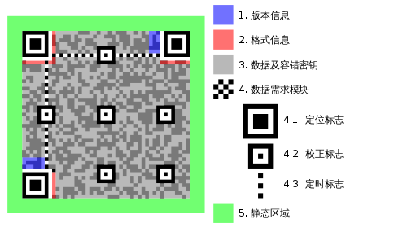
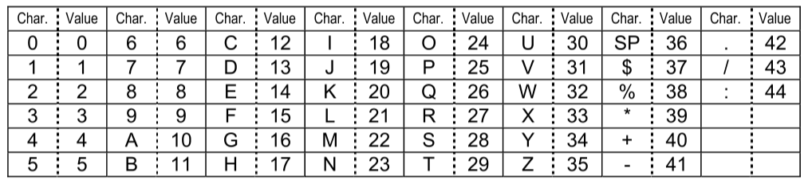

> Contributor：@保安 （0924 updated）

# QR Code Playground

**QR码**（英语：Quick Response Code；全称为**快速响应矩阵图码**）是二维码的一种，于1994年由[日本](https://zh.wikipedia.org/wiki/日本)[DENSO WAVE](https://zh.wikipedia.org/wiki/電裝)公司发明。QR来自英文 **Q**uick **R**esponse 的缩写，即快速反应，因为发明者希望QR码可以快速解码其内容。

我们本次使用的 QR 码遵循 [ISO/IEC 18004:2006](https://www.iso.org/standard/43655.html) 标准。事实上在 2015 年该标准又有了一次更新，但是生成 QR 码的基本步骤算法没有变化。

本文存在许多 $\mathrm{\LaTeX}$ 数学公式。请在本地渲染此 markdown 文档以获取最佳阅读体验。或者直接阅读同一目录下的 PDF 文件。


> 本题工作量稍大，建议有一定编程基础的同学选择这题。当然，这样的难度差距在评价时也会被考虑在内。
>
> 本题需要各位自己动手实现网络上随处可见的二维码生成器，所以不希望大家直接参考网络上其他人的代码。


## 0. 前言

本题希望大家了解 QR 码的编码原理，学习 QR 码的生成过程，并使用一门编程语言自己动手从零开始实现一个基本的二维码生成器。

需要大家做到的：

- 分阶段实现基本的二维码生成功能。具体要求会在下文中提出。
- 有充分的、有条理的、尽可能简明规范的注释。
- 学会自己在网络上查找合适的文档资料并自主学习完成。**这份教程并没有给出很多实现细节，这旨在驱使大家自己动手充分利用互联网获取自己想要的信息。**
- 编写一份简明的文档，列出主要函数的调用方式、参数信息、重要注释等等。
- 禁止调用他人或网络上已有的与二维码生成相关的库（可以使用 numpy 等工具库；最后的绘图步骤可以使用绘图库）。
- 如果实现全部功能比较困难，可以只实现部分。比如不实现 version 2 的 QR 码生成功能，或者不实现掩码的选择等等。我们最终考察的并非只是题目完成度，更多的是考察学习能力与态度。

最后需要大家提交的文件包括源代码和文档。


下面是一些额外的要求，希望大家尽量去做：

- 面向对象编程。具体的实现方式可以自行发挥（如数据类型、函数定义等），但我们希望你可以尝试一下面向对象的思路。
- 使用 Python 语言。当然，如果你没有任何 Python 基础，可能会比较困难，那么你可以使用其他你较为熟悉的语言。如果你对 Python 非常熟悉，那么可以试试其他你没那么熟悉的语言，比如 Java 等。这条是希望大家在能力范围内勇于使用自己舒适区外的语言，同时学会查阅语言文档。
- 规范化编程。规范化的编程不仅可以增加代码的可读性，还可以避免一些意料之外的 bug。
- 模块化编程。模块化的编程便于调试，也可以使代码更易读。
- 使自己的代码文件可以供他人作为库导入。为此，你撰写的文档应当足够明晰（不需要卷！）。


在开始之前，还需要简单介绍一下 QR 码。我们平常见到的很多正方形二维码都是 QR 码或者其变体。它们有个很明显的标志，就是三个角上的“回”字形标志，称为**定位标志**（Positioning detection markers）。扫描器在检测二维码时需要有着三个标志的存在才能定位二维码。当 QR 码尺寸较大时，其中还需要一些小的“回”字来辅助定位，称为**校正标志**（Alignment markings）。其中还有一些**定时标志**（Timing pattern）、版本信息与格式信息。剩余的部分就用来存储数据与纠错码。



QR 码也有很多分类。有一种分类是静态 QR 码与动态 QR 码。我们本次只讨论静态 QR 码(Static QR Code)。静态码中可以存储的信息类别也有很多，比如 URL、plain text、邮箱、WiFi 连接信息等等。我们本次只考虑对 plain text 编码的实现。

QR 码也有不同的尺寸，从最小的 version 1 (21 × 21 pixels) 到最大的 version 40 (177 × 177 pixels)。还有一种更小的 Micro QR Code。同时，QR 码需要支持纠错(Error correction)，按照标准有 L, M, Q, H 从低到高四种不同的纠错能力等级，它们会分别需要不同的纠错码数量。**只需要大家实现 version 1~2 尺寸的 QR 码即可。**实现更大尺寸 QR 码的方法与实现小尺寸的并无太大区别，所以这里不要求实现较大尺寸 QR 码的生成。

在具体编码之前，需要先确定所生成的二维码的尺寸与纠错等级。每种尺寸与纠错等级对应一个能够表示的数据的最大容量。所以还需要根据要编码的信息灵活选择。具体的对应关系在 QR Code 的标准中都有规定。这里给出一部分：

| Version / 版本 | Error correction level / 纠错等级 | Number of data bits / 数据位数 |
| -------------- | --------------------------------- | ------------------------------ |
| 1              | L                                 | 152                            |
| 1              | M                                 | 128                            |
| 1              | Q                                 | 104                            |
| 1              | H                                 | 72                             |
| 2              | L                                 | 272                            |
| 2              | M                                 | 224                            |
| 2              | Q                                 | 176                            |
| 2              | H                                 | 128                            |


## 1. 信息编码

众所周知，二维码中的信息需要用黑白色块，也就是 0 和 1 来表示。这意味着我们需要把要传达的信息编码成 01 串。

按照标准，QR 码有这样几种编码方式：

- Numeric mode: 适用于编码全数字的串。
- Alphanumeric mode: 适用于编码仅含有阿拉伯数字、大写字母与一些常用符号的字符串。**本次我们只考虑这种编码方式。**
- Byte mode: 适用于编码仅含有 ISO-8859-1 字符集字符的串。
- Kanji mode: 适用于编码含有 Shift JIS 字符集的串。对于有中文、日文等字符的信息，需要使用这个编码模式。
- 其他还有一些拓展的编码模式以及混合编码模式，这里不多赘述。

一般来说，编码信息时需要先合理选择使用的编码模式。但是本题只需要大家考虑 Alphanumeric 的编码方式，即只含有下表中 Char. 列所示的字符。



其中 SP 表示空格。

具体的编码方式是：

1. 将需要编码的字符串中的每个字符转换为对应的数字值（见上表）
2. 两两分组。每一组的数按照一定方式计算出一个值。
3. 将每一组的值转换为一个一定长度的二进制串。位数不足需要补前导 0。
4. 将得到的二进制串首尾依次拼接得到我们需要的编码后的数据串（Encoded Data）。

之后，我们还要在这个串的头部加入一些必要的信息。

1. 加入编码方式的信息。每种编码方式都有一个对应的 4 位 01 串（Mode Indicator）。
2. 加入原数据字符串的字符个数。对于 version 1~9 尺寸的 QR 码，需要将位数转换为一个 9 位的 01 二进制串（Character Count Indicator）。

将编码方式、字符个数、数据串和一个 4 位终止符 0000 （Terminator）依次首尾连接，得到一个较长的 01 数据流（Bit stream）。

下一步是将这个数据流转化为许多**码字**（Codewords）。一个码字包含 8 位（8 bits），所以需要先将这个数据流的长度补成 8 的倍数。具体方法是在终止符前加入尽可能少数量的 0。之后，我们还需要把它补足到足够的位数（由选择的 QR 码尺寸与纠错等级决定）。补足时只需在末尾重复加入 11101100 和 00010001 两个串即可。这一步结束之后，就可以将这个数据流每 8 位视作一个码字，并进入之后的步骤。

至此，数据编码部分就完成了。


> 对于这一部分做一些补充说明：
>
> - 实现可以调用某函数将字符串编码为一个 01 数据流（包括全部的头部信息、数据部分、补位部分）的功能。这个函数的具体调用方式可以自行定义，但请把这个函数列入文档中。
> - 只需实现 Alphanumeric 的编码方式，其余的不做要求。
>


## 2. 计算纠错码

这一部分看似需要一些数学与算法基础，但事实上如果没有基础也可以理解它的内容，因为它对于数学知识的运用并不深。

第一步是要将这若干个码字分组。当数据规模较大时，需要对每一组分别计算纠错码。但在本题中，由于需要实现的 QR 码尺寸不大，所以只需要分成一组（也就是不分组）。

接下去是对每一组计算纠错码。QR 码采用的是在[伽罗华域](https://en.wikipedia.org/wiki/Galois_field) GF(256) 上的[里德-所罗门码](https://en.wikipedia.org/wiki/Reed%E2%80%93Solomon_error_correction)。

#### 伽罗华域

在伽罗华域（有限域）中数字的计算与我们平常的数字计算方式有所不同。

QR 码纠错码的计算需要用到的是信息领域常用到的伽罗华域 GF(256)。这个域有有限个元素（准确来说是 256 个元素），并对加法和乘法满足封闭性、结合律、交换律、分配律，具有单位元和可逆性。

对于 GF(p) （p 是一个质数），我们可以定义其中的元素为 0 ~ p-1，加法 $\oplus$ 定义为 $a \oplus b = a + b \bmod p$，乘法 $\otimes$ 定义为 $a \otimes b = a \times b \bmod p$。

而对于里德-所罗门编码需要用到的 GF(2^8) 来说，其中的元素有很多表示的方式。其中一种，是把其中的元素都看作一个 7 次的多项式，每一项的系数只能是 0 或 1。具体地，例如一个元素在十进制下表示为 105，105 的二进制表示为 01101001，将二进制下的每一位都作为多项式表示下的系数，就可以得到 105 的多项式表示：$x^6 + x^5 + x^3 + 1$。

**系数**的加法与减法等价，都是 $a + b \bmod 2$ ，也就是等同于 $a \text{ xor } b$。**系数**的乘法也就是 $a \times b \bmod 2$ 。

那么 GF(256) 中的元素加减乘法也就可以得到定义：

**加法**即为将两元素的多项式表示进行一次多项式加法。其中系数相加/减时满足上面所说的运算法则。

例如十进制表示下的 105 与 27 相加：它们的多项式表示为 $x^6 + x^5 + x^3 + 1$ 与 $x^4 + x^3 + x + 1$ 。相加结果为 $x^6 + x^5 + x^4 + x$。

**乘法**即为将两元素的多项式表示进行一次多项式乘法。这里的多项式乘法满足分配律与交换律，所以可以拆开分项相乘再相加。结果多项式的次数可能大于 7 次，所以要对一个“素数”取模。我们选用这个域下的一个“素数” 285，它的多项式是 $x^8 + x^4 + x^3 + x^2 + 1$。这个多项式被称为本原多项式，它在 GF(256) 上不可约，所以它就像是一个“素数”。当乘法的结果大于 7 次时，我们要把结果多项式对本原多项式取模。取模的过程使用**长除法**，这与平常用的长除法类似，只是用异或操作代替了减法。

下面就是一个长除法求余的例子。

```
  1010001111010
^ 100011101
  -------------
  0010110101010
  ^ 100011101
    -----------
    00111011110
    ^ 100011101
      ---------
      011000011
```

这样计算乘法有些麻烦。

所以需要引入域中元素的另一种表示：对数表示。每个元素都可以表示为 $\alpha^x$ ，这里 $\alpha = 2$。利用 $\alpha$ 可以生成出 GF(256) 中的所有元素。具体方式见下：

| $\alpha^x$     | 二进制表示 | 十进制表示 | 多项式表示      |
| -------------- | ---------- | ---------- | --------------- |
| $\alpha^0 = 1$ | 0000 0001  | 1          | $1$             |
| $\alpha^1$     | 0000 0010  | 2          | $x$             |
| $\alpha^2$     | 0000 0100  | 4          | $x^2$           |
| $\alpha^3$     | 0000 1000  | 8          | $x^3$           |
| $\alpha^4$     | 0001 0000  | 16         | $x^4$           |
| $\alpha^5$     | 0010 0000  | 32         | $x^5$           |
| $\alpha^6$     | 0100 0000  | 64         | $x^6$           |
| $\alpha^7$     | 1000 0000  | 128        | $x^7$           |
| $\alpha^8$     | 0001 1101  | 29         | $x^4+x^3+x^2+1$ |
| $\alpha^9$     | 0011 1010  | 58         | $x^5+x^4+x^3+x$ |
| $\alpha^{10}$  | 0111 0100  | 116        | $x^6+x^5+x^4+x^2$ |
| $\alpha^{11}$  | 1110 1000  | 232        | $x^7+x^6+x^5+x^3$ |
| $\alpha^{12}$  | 1100 1101  | 205        | $x^7+x^6+x^3+x^2+1$ |
| $\alpha^{255}$ | 0000 0001  | 1          | $1$             |

简单来说，对于二进制表示，每次将前一项乘以 2 （也就是左移一位）。如果得到的结果大于 255，那么异或上 285（之前提到的“素数”）；对于多项式表示，每次将前一个多项式乘上 $x$ ，如果得到的次数大于 7 次，那么减去（注意系数的加减法等同于异或）本原多项式 $x^8 +x^4+x^3+x^2+1$。

以此类推，最后得到 $\alpha^{255} = 1$ 时为止。这样以来，我们就可以利用对数表示来更快的计算乘法。

众所周知，$x^a \cdot x^b = x^{(a+b)}$ 。这里也一样，$\alpha ^x \times \alpha^y = \alpha^{(x+y)}$。当 $x+y$ 的值大于 255 时，由于 $\alpha^{255} = 1$，所以可以将指数对 255 取模。

举个例子，将十进制表示下的 105 与 27 相乘。105 的对数表示是 $\alpha^{58}$，27 的对数表示是 $\alpha^{248}$，$105 \otimes 27 = \alpha^{58 + 248} = \alpha^{306} = \alpha^{306 \bmod 255} = \alpha^{51}$ 。$\alpha^{51}$ 的十进制表示是 10。这一运算结果可以用之前讲的多项式乘法运算的方法验证。

使用对数表示计算乘法非常简便，唯一的问题是离散对数的求解没有优秀的方法。但因为 GF(256) 中元素个数不多，可以通过预先处理后查表的方式解决。

#### 里德-所罗门码

了解了在伽罗华域中的计算之后，就可以来计算需要用到的纠错码了。

首先，需要计算出一个信息多项式（Message Polynomial）$M(x)$。这个多项式并非是伽罗华域中某一元素的多项式表示，而是一个**系数均为伽罗华域中元素**的多项式。$M(x) = p_{n-1}x^{n-1} + p_{n-2}x^{n-2} + p_{n-3}x^{n-3} + \cdots p_1x + p_0$。这里的系数就是在**信息编码**步骤中最后计算出的**码字**。将码字依次转换为十进制，按顺序当作是 $M(x)$ 的系数。而式中的 $n$ 就是这些码字的数量。

我们还需要一个生成多项式（Generator Polynomial）$G(x)$。计算方法是 $\displaystyle G(x) = \prod_{i=0}^{m-1} \left(x-\alpha^i\right)$。其中 $m$ 等于由纠错等级和尺寸决定的纠错码码字的数量。比如，version 为 1，纠错等级为 M 的 QR 码所需的纠错码码字数量为 10 个。所以上式中 $m = 10$ 。注意这个多项式的系数也是伽罗华域中的元素，所以加减乘法均应按照上文讲到的方法进行。

里德-所罗门码的计算公式其实很简单，就是将 $M(x) \cdot x^m$ 对 $G(x)$ 求余。具体来说，求一个次数小于 $m$ 的多项式 $R(x)$ ，使得 $M(x)\cdot x^m = D(x)G(x) + R(x)$。$R(x)$ 就是所求的余数多项式。而 $R(x)$ 每一项系数的十进制表示就是所求的纠错码的码字。


为了帮助大家 debug，这里给出 `HELLO WORLD` 在 version 1, 纠错等级为 M 时的纠错码：196 35 39 119 235 215 231 226 93 23。


> 对于这一部分进行一些补充说明：
>
> - 实现可以调用某函数根据尺寸和纠错能力等级计算一串码字的纠错码的功能。这个函数的具体调用方式可以自行定义，但请把这个函数列入文档中。
> - 不要求在性能上进行优化，但至少应在能接受的时间长度内计算出答案。
>


## 3. 填充矩阵

在进行填充之前还需要将之前算出的全部数据按一定的顺序排列。但是此次采用的小尺寸 QR 码只需把第一部算出的数据简单地放在第二步算出的纠错码前面就行。之后把全部的码字转换回二进制串，将其首尾相接，按照标准补足剩余的位数。

得到数据串后，按步骤填充矩阵。

1. 先绘制定位标志、校正标志、定时标志
2. 预留出版本信息、格式信息的区域
3. 从右下角开始按规定顺序填充数据串。1 为黑色，0 为白色。注意避开已填充的位置和预留出的区域。


> 对于这一部分进行一些补充说明：
>
> - 实现可以调用某函数将数据流码字和纠错码码字转换为最终的 01 数据串的功能。这个函数的具体调用方式可以自行定义，但请把这个函数列入文档中。
> - 实现可以调用某函数按照尺寸填充 QR 码定位标志、校正标志、定时标志等非数据位置的功能。这个函数仅需填充定位标志等，不需要填充数据位置。这个函数的具体调用方式可以自行定义，但请把这个函数列入文档中。
> - 实现可以调用某函数将 01 数字串填充进 QR 码矩阵的功能。这个函数仅需填充数据串，不需要填充定位标志等位置。这个函数的具体调用方式可以自行定义，但请把这个函数列入文档中。
>


## 4. 选择掩码

刚填充好的 QR 码矩阵很容易出现大面积连续的同色色块。为了便于扫描器的检测，我们需要对这个二维码选择一个合适的掩码图案。掩码只会在数据和纠错码部分进行操作，不会影响其他定位用标志以及版本信息等重要信息。而掩码其实就是有规律地对某些位置进行异或操作（更简单地来说就是翻转黑白色）。

可选的掩码图案有 8 种。需要依次评估每个掩码的罚分（Penalty）。具体来说，有 4 个评估测试。分别是：

1. 连续同色色条检测。
2. 同色色块检测。
3. 特殊模式图案检测。
4. 黑白比例检测。

每条检测都规定的检测方式与罚分。最后应在 8 种掩码图案中选取罚分最少的那一种。


> 对于这一部分进行一些补充说明：
>
> - 实现可以调用某函数将已填充好定位等标志、数据部分以及纠错码部分的 QR 码矩阵选择并应用掩码的功能。需要记录选择的掩码图案编号（可以通过函数返回值返回，也可以记录在成员变量中）。这个函数的具体调用方式可以自行定义，但请把这个函数列入文档中。
>


## 5. 填充格式信息

格式信息串包括纠错等级、掩码图案编号信息，是一个 5 位的 01 串。

由于格式信息串十分重要，所以还需要为计算格式信息串单独计算纠错码。这里的纠错码与之前的稍有不同。QR 码标准中规定了这一步骤所使用的生成多项式（Generator Polynomial）为 $x^{10} + x^8 + x^5 + x^4 + x^2 + x + 1$。

这次直接将格式信息串的每一位作为信息多项式的系数。然后将 $M(x) \cdot x^{10}$ 对 $G(x)$ 求余。余数多项式的系数依次相接就可以得到一个 10 位的 01 纠错码串。

将两串拼接，得到一个 15 位的 01 串。再把该串异或上另一个规定的掩码串，得到最终能够填入 QR 码中的格式信息串。

不难发现，这个格式信息串只与纠错等级和掩码图案编号有关。所以可以根据这两个信息直接查表得到。

版本信息串只会在 version 7 及以上尺寸的 QR 码中用到。所以这里不做介绍。

计算得到格式信息串之后将其按一定顺序填充进预留出的位置中即可。

至此，QR 码已完全生成。


> 对于这一部分进行一些补充说明：
>
> - 实现可以调用某函数根据纠错等级和掩码图案编号计算格式信息串的功能。计算出的格式信息串应包含纠错码，并已经过掩码。这个函数的具体调用方式可以自行定义，但请把这个函数列入文档中。
> - 实现可以调用某函数根据纠错等级和二维码尺寸生成最终二维码的功能。这个函数的具体调用方式可以自行定义，但请把这个函数列入文档中。
>


## 6. 绘制图片

如果你还有余力，那么可以尝试将生成的二维码 01 矩阵转化为正式的图片输出。这一步可以调用你喜欢的绘图库。

如果你实现了这一功能，请将绘制图片函数的调用方式写入文档。


为了帮助大家调试，这里给出 `HELLO WORLD` 的 version 1，纠错能力等级为 M 的 QR 码图片：


## 7. 总结与反思

如果对本题有什么疑问或者何处表述有错误，请联系 @保安 。

在文档中，需要你在开头或者结尾部分回答下列问题：

1. 你觉得解决这个任务的过程有意思吗？
2. 你在网上找到了哪些资料供你学习？你觉得去哪里/用什么方式搜索可以比较有效的获得自己想要的资料？
3. 在过程中，你遇到最大的困难是什么？你是怎么解决的？
4. 完成任务之后，再回去阅读你写下的代码和文档，有没有看不懂的地方？如果再过一年，你觉得那时你还可以看懂你的代码吗？
5. 在完成任务之后，如果要求你在已写好的代码基础上再加入生成 version 3~40 的二维码的功能，你是否会选择重新规划代码结构并重写大部分代码？
6. 其他想说的想法或者建议。

那么二面题就到这里了, 期待与你的见面~

以上。